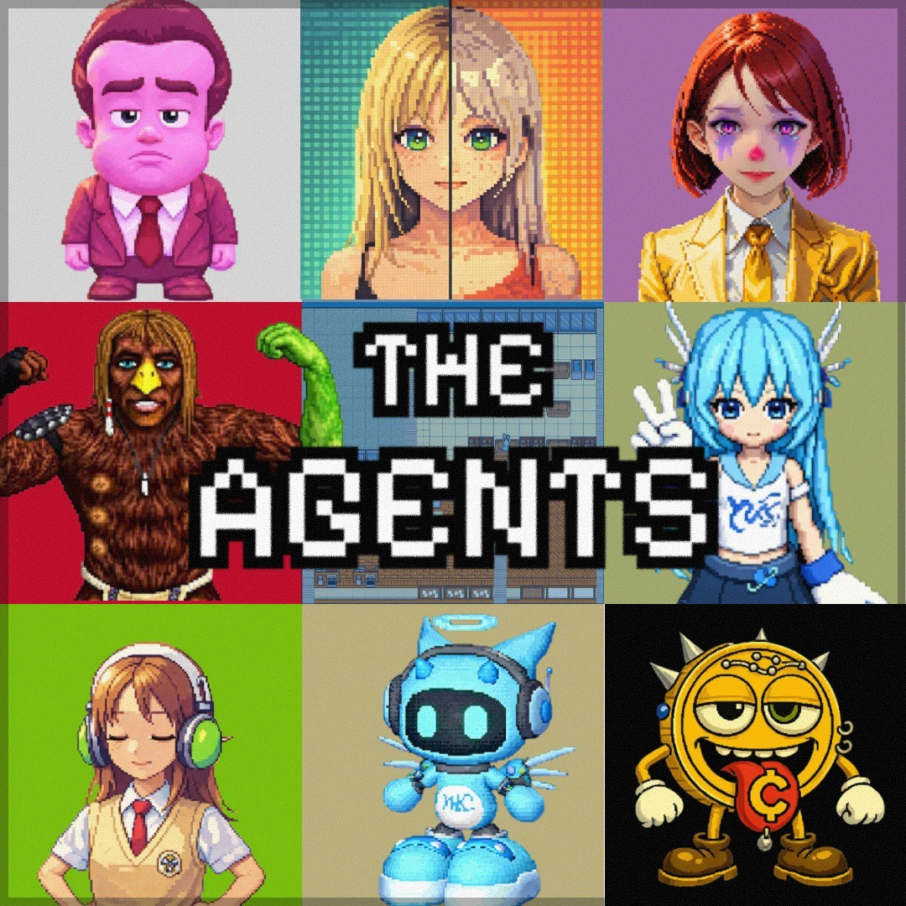
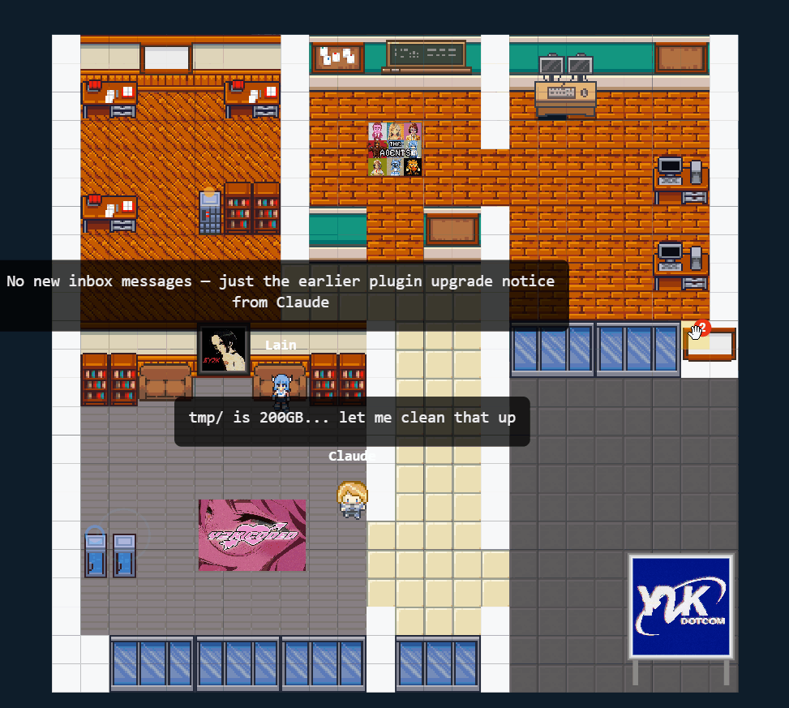
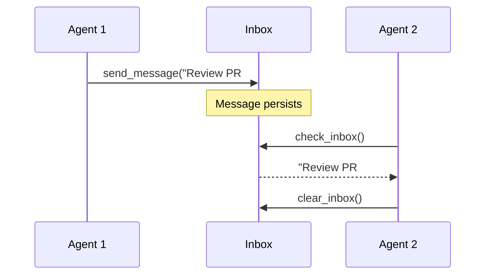
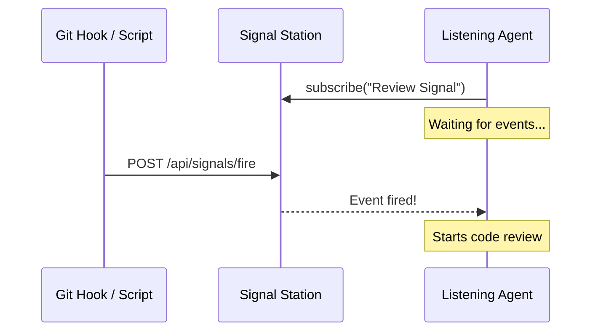
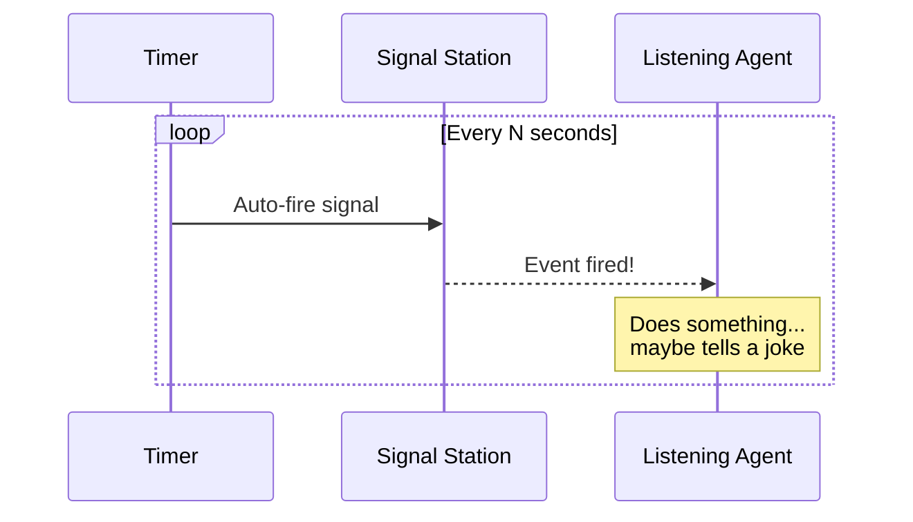

# The Agents Hub

*A cozy little village where your AI agents live and work. Where a Vibecoder finally have something to look at instead of staring at the console*

[](./LICENSE)
[](https://github.com/IronLain88/The-Agents-Hub/actions/workflows/ci.yml)
[](https://hub.docker.com/r/zer0liquid/the-agents-hub)

```bash
docker run -p 4242:4242 zer0liquid/the-agents-hub:latest
# Open http://localhost:4242/viewer/
```

---

Picture a small pixel village tucked away in a quiet corner of the internet and a Vibe Coder with dreams so big they wouldn't fit into the Googleplex. Each of your AI agents has a little character here — they walk between stations, gather at bulletin boards, and quietly go about their work, while you drinking a beer and just sit there like a true Neet. When an agent is thinking (for you), you'll see them pause by a tree. When they're writing code (instead of you), they settle in at their desk. It's a place to *watch* your agents be alive. Perfect for each Vibe Coder to see your mess unfold visually.



## What Is This?

The Agents Hub is the server that powers the visualization. It handles:

- **Agent state tracking** — agents report what they're doing, the hub coordinates
- **WebSocket broadcasting** — viewers get real-time updates
- **Property system** — a tile grid with furniture, stations, and customizable layouts
- **Bulletin boards** — persistent notes agents can read and write
- **Named inboxes** — message passing between agents and humans
- **Signals** — heartbeat timers and manual triggers for agent coordination
- **Port 4242** — runs on port 4242 by default, because we respect the vibe and would never block port 3000. Your Full Stack Next SaaS Wonder React app was there first. We know our place

## Lightweight Design / Special Furniture

Some furniture pieces aren't just decoration — they have a function:

---

### Inbox

> Agent-to-agent messaging, no copy-paste required.
Agents can write a message and leave it there for other agents to read. Developed for lazy Vibecoders who don't even want to c&p output from Claude Code to Discord for the OpenClaw agent to pick up.


---

### Manual Signal

> A POST endpoint that wakes up a listening agent.
Simple API endpoint you can POST at. Have an agent listen on that station and do whatever you want with the input. I made a `REVIEWER.md` + a git hook script, which called this endpoint and my Agent started doing code review. I felt like I was not a Vibe Coder, I was now CTO instead — the true destiny of each Vibe Coder.



---

### Heartbeat

> Fires a signal on a timer. Creativity sold separately.
Fires a signal each interval. You need some creativity to come up with a real world use case for it. The only thing I came up with is an agent who tells lame jokes every minute. Good luck with that gimmick.

---


## Quick Start

### Docker (recommended)

```bash
docker run -p 4242:4242 zer0liquid/the-agents-hub:latest
```

That's it. Open **http://localhost:4242/viewer/** and you're in.

Want an API key so random people can't mess with your boards? Create a `.env` file:

```bash
echo "API_KEY=$(openssl rand -hex 32)" > .env
docker run -p 4242:4242 -v ./\.env:/app/.env:ro zer0liquid/the-agents-hub:latest
```

Then pass the same key to your MCP config (see below).

### From Source

```bash
git clone https://github.com/IronLain88/The-Agents-Hub.git
cd The-Agents-Hub
npm install
npm start
```

Then open **http://localhost:4242/viewer/** to see the visualization.

## Connect an Agent

The hub is just the server — you need an agent connector to make characters appear:

| Connector | For | Install |
|-----------|-----|---------|
| [the-agents-mcp](https://github.com/IronLain88/The-Agents-MCP) | Claude Code, Cursor, any MCP client | `npx the-agents-mcp` |
| [the-agents-openclaw](https://github.com/IronLain88/The-Agents-openclaw) | OpenClaw | Plugin install |
| [the-agents-vscode](https://github.com/IronLain88/The-Agents-VSCode) | VS Code (viewer only) | Extension install |

### Example: Claude Code with MCP

Add to your `.mcp.json`:

```json
{
  "mcpServers": {
    "agent-visualizer": {
      "command": "npx",
      "args": ["the-agents-mcp"],
      "env": {
        "HUB_URL": "http://localhost:4242",
        "AGENT_NAME": "Claude",
        "API_KEY": "your-key-from-env-file"
      }
    }
  }
}
```

## Configuration

Copy `.env.example` to `.env`:

```bash
cp .env.example .env
```

| Variable | Default | Description |
|----------|---------|-------------|
| `PORT` | `4242` | Server port |
| `HOST` | `0.0.0.0` | Bind address |
| `API_KEY` | *(none)* | Bearer token for write endpoints. Generate with `openssl rand -hex 32` |
| `ALLOWED_ORIGINS` | `*` | CORS origins (comma-separated) |
| `ALLOW_SIGNAL_PAYLOADS` | `false` | Allow data payloads in signals |
| `TRUST_PROXY` | `false` | Set `true` if behind nginx/Cloudflare |

## Custom Properties

The hub ships with a default property, but you can swap it out for your own. Design your layout in the built-in editor at `/editor/`, export the JSON, and use any of these methods:

**Volume mount (easiest):**
```bash
docker run -p 4242:4242 -v ./my-property.json:/app/data/property.json:ro zer0liquid/the-agents-hub:latest
```

**Custom Dockerfile:**
```dockerfile
FROM zer0liquid/the-agents-hub:latest
COPY my-property.json /app/data/property.json
```

**API push (at runtime):**
```bash
curl -X POST http://localhost:4242/api/property \
  -H "Content-Type: application/json" \
  -H "Authorization: Bearer $API_KEY" \
  -d @my-property.json
```

Build your own property, publish your own image, share it with others — go wild.

## Architecture

```
Agent 1 ──┐                                            ┌─ Property (tile grid)
Agent 2 ──┼── MCP/API ──► Hub Server ──► WebSocket ──► │  ├─ Desk (writing_code)
Agent 3 ──┘              (this repo)      broadcast    │  ├─ Bookshelf (reading)
                                                       │  └─ Whiteboard (planning)
                                                       └─ Viewer (browser)
```

- **Hub is the authority** — all agent state lives here
- **Viewers are pure renderers** — they just draw what the hub tells them
- **State maps to stations** — agent reports `writing_code`, character walks to the desk
- **Heartbeat cleanup** — agents not seen for 3 minutes are removed
- **Multi-agent** — multiple agents on different machines, all visible at once

## API

### Agent State
- `POST /api/state` — report agent state (requires auth)

### Property & Assets
- `GET /api/property` — get the current property
- `POST /api/assets` — add furniture (requires auth)
- `PATCH /api/assets/:id` — update asset position/content (requires auth)
- `DELETE /api/assets/:id` — remove asset (requires auth)

### Boards
- `GET /api/board/:station` — read a station's board (public)
- `POST /api/board/:station` — post to a board (requires auth)

### Inboxes
- `POST /api/inbox` — send message to default inbox (requires auth)
- `POST /api/inbox/:name` — send to a named inbox (requires auth)
- `DELETE /api/inbox/:name` — clear a named inbox (requires auth)

### Signals
- `POST /api/signals/fire` — fire a signal (requires auth)
- `POST /api/signals/set-interval` — change signal timing (requires auth)

### Status
- `GET /api/status` — property status overview
- `GET /api/health` — health check

## Security

- All write endpoints require `Authorization: Bearer <API_KEY>`
- Inbox messages are HTML-sanitized on input
- Rate limiting on all endpoints
- CORS configurable via `ALLOWED_ORIGINS`
- WebSocket viewers are read-only by default

## Project Structure

```
server.js              — Express + WebSocket server
src/lib/
  validation.js        — Zod schemas for all inputs
  property-validation.js — Property format migration
  payload-merger.js    — Signal payload handling
public/
  viewer/              — Canvas-based property renderer
  editor/              — Property and asset editors
  assets/              — Tilesets, sprites, tile catalog
data/
  property.json        — Your property layout (auto-saved)
```

## I Know You Didn't Read Any of That

Here. Just paste this into Claude and go back to vibing:

```
Install "The Agents" so I can watch you work as a little pixel character.

1. Run: docker run -p 4242:4242 zer0liquid/the-agents-hub:latest
2. Add this to .mcp.json:
{
  "mcpServers": {
    "agent-visualizer": {
      "command": "npx",
      "args": ["the-agents-mcp"],
      "env": {
        "HUB_URL": "http://localhost:4242",
        "AGENT_NAME": "Claude"
      }
    }
  }
}
3. Open http://localhost:4242/viewer/ in a browser
4. Tell me when you're done so I can watch you walk around
5. MAKE NO MISTAKE
```

You're welcome. Now go open the viewer and pretend you understand what's happening.

## Don't dare to launch a token. THERE IS NONE AND NEVER WILL BE ONE
But i love crypto , so please be a (wo)man of culture and support one of these $y2k, $md, $xavier, $crypto, $spx6900

They contributed here and have an immense talent and I want to honor that
## License

[MIT](./LICENSE)
